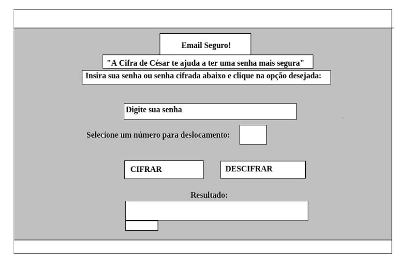
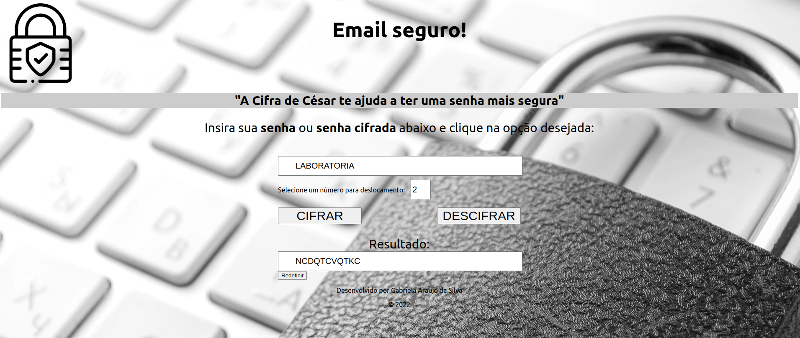

# Email Seguro! (Cifra de César)

## Índice

* [1. Prefácio](#1-prefácio)
* [2. O que é a Cifra de César?](#1-o-que-é-a-Cifra-de-César-?)
* [3. Resumo do projeto](#2-resumo-do-projeto)
* [4. Público Alvo](#3-público-alvo)
* [5. Como utilizar o Email Seguro!](#4-como-utilizar-o-Email-eguro-!)
* [6. Esboço e aplicação](#5-esboço-e-aplicação)
* [7. Resultado final](#7-resultado-final)  
* [8. Tecnologias utilizadas](#6-tecnologias-utilizadas)

***

## 1. Prefácio

A cifra de César é uma das técnicas mais simples de cifrar uma mensagem, recebe esse nome pois foi utilizada por Júlio César para se comunicar com seus generais, protegendo mensagens militares. É um tipo de cifra por substituição, em que cada letra do texto original é substituida por outra que se encontra há um número fixo de posições (deslocamento) mais a frente do mesmo alfabeto.

## 2. Resumo do projeto

Com base nos princípios da Cifra de César, o 'Email Seguro!' permite que o usário cifre ou decifre uma palavra para utilizar em sua senha de email. É necessário escolher uma chave de deslocamento.

## 3. Público alvo

Esta página web é destina as pessoas que queiram cifrar ou descifrar uma palavra distinta para utiliza-la em sua senha de email.

## 4. Como utilizar o Email Seguro!

É bem simples, na primeira caixa de texto indicada escreva a palavra que deseja cifrar, escolha o Offset (número de deslocamento que deseja que sua mensagem tenha) e clique no botão "Cifrar", sua mensagem cifrada aparecerá na caixa de texto abaixo. Para descifrar repita o mesmo procedimento e clique no botão "Descifrar" desta vez.

## 5. Esboço e aplicação

Inicialmente foi criado um layout simples para que o usuário pudesse criptografar e descriptografar uma senha.

**Protótipo de baixa fidelidade**

Primeiro desenho:

## 7. Resultado Final

## 8. Tecnologias utilizadas

